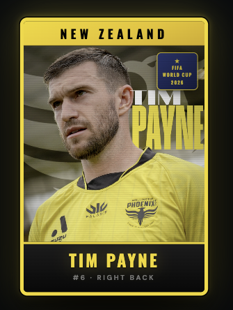

# No Payne No Gain 🇳🇿⚽

> The world's first fan app for Tim Payne — the least-known player at the 2026 FIFA World Cup who became the most followed overnight.



**Live:** [timpaynefans.vercel.app](https://timpaynefans.vercel.app)

---

## The Story

Argentine influencer El Scarso searched every World Cup squad for the least-known player. He found **Tim Payne** — a right back from Wellington, New Zealand, with 4,715 Instagram followers.

He asked the internet to follow him.

Within 48 hours, Tim hit **2.5 million followers**. Brands piled in. A song was written in his honour. T-shirts were printed in Buenos Aires. Duolingo, KFC and McDonald's jumped into his comments.

Tim DMed El Scarso: *"Was wondering why my socials were blowing up."*

This app is the fan army's home base.

---

## Features

- **🇳🇿 Panini Card Hero** — Vintage sticker card design as the app entry point
- **👆 Tap for Tim** — Global support counter. Every tap counts toward the army
- **⚽ Daily Missions** — Earn Payne Points through daily challenges
- **🎵 Chant Generator** — Personalised fan chants in the "Muchachos" style, shareable to social
- **🏆 Badge Collection** — 12 collectible badges across 4 rarity tiers (Common → Legendary)
- **🔥 Streak Tracking** — Come back daily to keep the fire going
- **📊 Player Stats** — Tim's full career breakdown
- **📖 The Origin Story** — The full timeline of the phenomenon

---

## Tech Stack

| Layer | Tech |
|-------|------|
| Web | Vanilla HTML/CSS/JS — zero dependencies |
| Mobile | React Native (Expo SDK 54) |
| Hosting | Vercel (web) |
| Native Build | EAS Build (iOS + Android) |
| Fonts | Playfair Display + DM Sans |

---

## Project Structure

```
NoPayneNoGain/
├── web/                  # Live web app (deployed to Vercel)
│   ├── index.html        # Single-file app — all HTML, CSS, JS
│   └── vercel.json
├── app/                  # Expo native app screens
│   └── (tabs)/
│       ├── index.tsx     # Hype screen
│       ├── missions.tsx  # Daily missions
│       ├── chants.tsx    # Chant generator
│       └── profile.tsx   # Badge collection
├── src/
│   ├── constants/        # Theme, game data, badges
│   ├── hooks/            # Game state context
│   └── lib/              # Game logic, persistence
├── App.tsx               # Native app root
├── app.json              # Expo config
└── eas.json              # EAS Build config
```

---

## Run Locally

### Web
```bash
# Just open the file
open web/index.html

# Or serve it
npx serve web
```

### Native (iOS / Android)
```bash
# Install dependencies
npm install --legacy-peer-deps

# Start dev server
npx expo start

# Build for production (requires EAS account)
eas build --platform ios --profile production
eas build --platform android --profile production
```

---

## Roadmap

- [x] Web app (live)
- [x] Panini card hero
- [x] Tap counter + global army counter
- [x] Daily missions + Payne Points
- [x] Custom chant generator
- [x] Badge collection system
- [ ] iOS App Store release
- [ ] Android Google Play release
- [ ] Real-time global tap counter (shared across all users)
- [ ] Match day mode (live hype during NZ World Cup games)
- [ ] Leaderboard by country
- [ ] OTA mission updates for each World Cup match

---

## Links

- 🌐 **Live app:** [timpaynefans.vercel.app](https://timpaynefans.vercel.app)
- 📸 **Tim Payne:** [@timpayne__](https://www.instagram.com/timpayne__)
- 🇦🇷 **El Scarso:** [@elscarso](https://www.instagram.com/elscarso)
- 🏟️ **Wellington Phoenix:** [wellingtonphoenix.com](https://wellingtonphoenix.com)

---

## Disclaimer

Unofficial fan app. Not affiliated with FIFA, Wellington Phoenix FC, or Tim Payne. Made with love by fans, for fans.

*No Payne, No Gain. 🏆*
